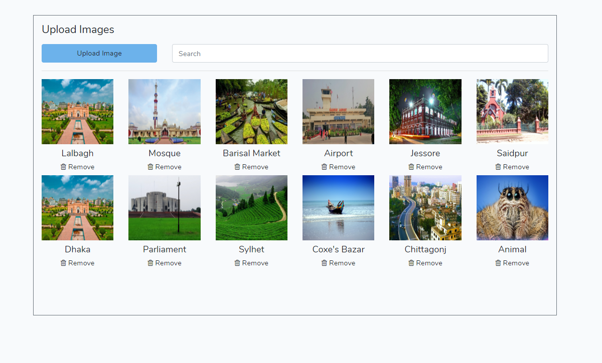
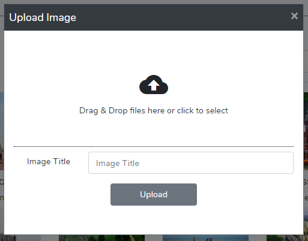
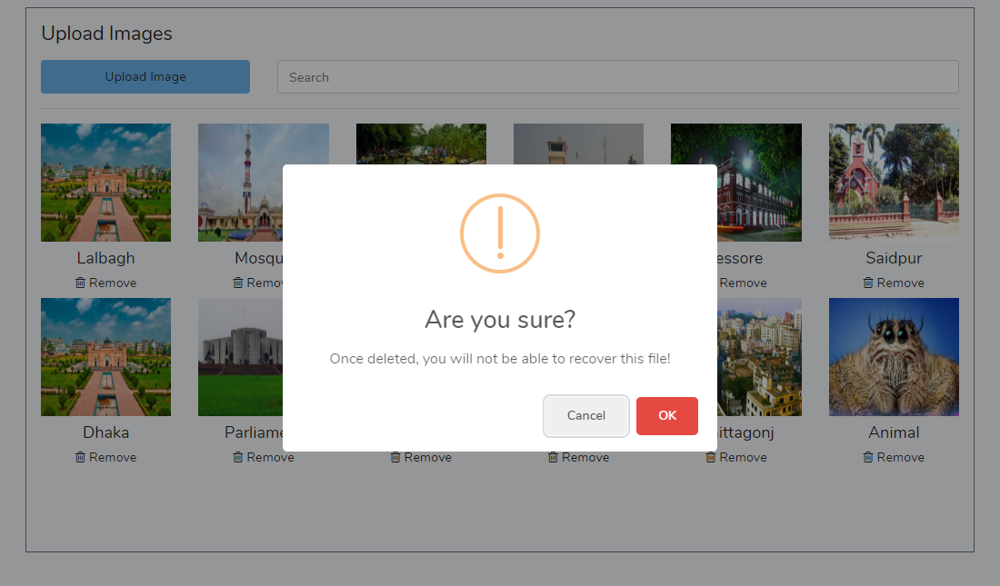
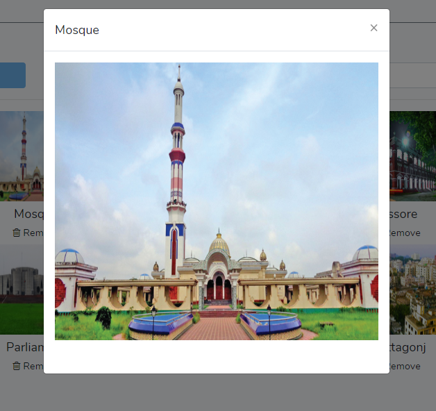

## Laravel 7 File Upload


### Installation
```sh
git clone https://github.com/iamsukanta/Laravel-Jquery-File-Uploader-in-JSON-File
cd Laravel-Jquery-File-Uploader-in-JSON-File
composer install
```

### Config

* To run locally -``` php artisan serve```
* That's it

# Project Image
## Home page


## Aboutme page


## Portfolio page


## Contact page

